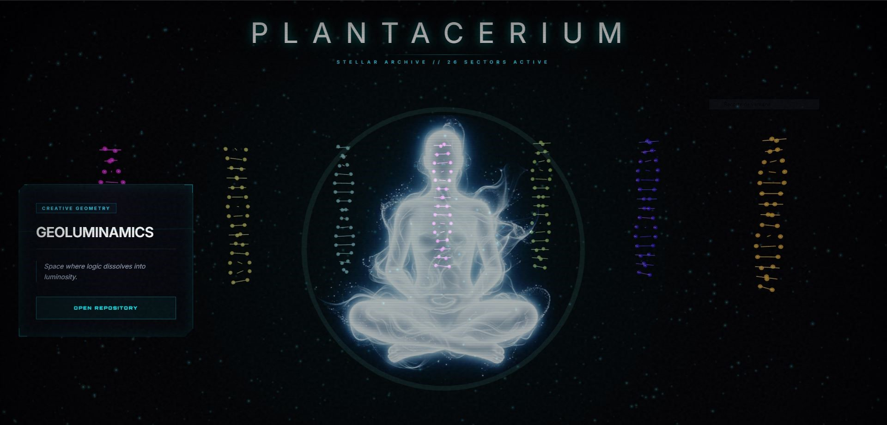

# 🧬 Plantacerium | The Stellar Nexus Archive

**Plantacerium** is a high-fidelity, immersive 3D archive designed to visualize the evolution of the "Museum Stelar" ecosystem. Built with a cinematic "Expanse-style" aesthetic, it transforms GitHub repository data into a celestial constellation of interactive DNA double helixes.

## ✨ Features

- **Double Helix Visualization**: Each of the 26 repositories is represented by a procedurally generated DNA strand, symbolizing the "genetic code" of the software.
- **Perfect Circular Geometry**: An mathematically precise distribution of nodes arranged in a 360° planetary nexus.
- **Advanced Glassmorphism HUD**: A custom-built **Holo-Glass Panel 3.0** interface providing real-time telemetry and project metadata.
- **Cinematic VFX Core**:
  - **Chromatic Aberration & Glitch Effects**: Subtle lens distortions for a sci-fi feel.
  - **Stellar Dust Bloom**: A field of 25,000 glowing spherical particles with additive blending.
  - **Volumetric Nebula**: A deep-space atmospheric background that reacts to camera depth.
- **Dynamic Spectral Signatures**: Every DNA strand features a unique chromatic frequency (26 variations) based on the Golden Angle distribution.
- **Expansive Navigation**: Fully responsive camera with "Deep Space Zoom" capabilities and restored standard context menu (Right-Click enabled).

## 🚀 Technology Stack

- **Core Engine**: [Three.js](https://threejs.org/) (WebGL rendering)
- **Styling**: [Tailwind CSS](https://tailwindcss.com/)
- **Typography**: [Orbitron](https://fonts.google.com/specimen/Orbitron) (UI/HUD) & [Inter](https://fonts.google.com/specimen/Inter) (Body)
- **Geometry**: Procedural Buffer Geometries
- **Lighting**: ACES Filmic Tone Mapping with high-intensity Emissive Materials

## 🛠️ Setup & Usage

Since the project uses Three.js textures, it requires a local server to avoid CORS issues:

1. Clone this repository.
2. Open the directory in your terminal.
3. Start a local server (e.g., using `npx serve`, Python `http.server`, or the Live Server extension in VS Code).
4. Navigate to `index.html` in your browser.

---

*Museum Stelar Plantacerium Sun System.*
